## Overview

As the second-largest city in the Czech Republic and the heart of the **Morava** region, **Brno** is a city that perfectly blends a deep historical heritage with a youthful soul. Compared to the hustle and bustle of **Praha**, tourists here are few and far between, which instead preserves the most authentic sense of Czech life and a high-quality, slow-paced rhythm.

The attractions in the old town (**Historické centrum**) are highly concentrated, making it perfectly suited for simply wandering on foot. You can climb the **Katedrála svatého Petra a Pavla** for a bird's-eye view of the sea of red roofs, feel the rustic local pulse at **Zelný trh**, or head to **Náměstí Svobody** to wait for a lucky marble to drop from the black **Brněnský orloj**. This city remains beautifully untouched by over-commercialization, and it preserves its pristine natural landscapes as places for locals to unwind and hike. This is the city where I lived for a year. From the old town landmarks I passed by every single day to the rich natural landscapes in the suburbs, down to various restaurants, camera shops, and music stores, I am sharing all my personal recommendations with absolutely nothing held back.
## Must-See Attractions

Most of the main attractions are located near the main train station (**Brno hlavní nádraží**) and the **Grand Hotel** bus station. They are easily accessible on foot upon arrival. At first glance, the city feels a bit like a beautifully medieval version of Zhongli (where I studied in Taiwan).

### Itinerary Planning

#### One-Day Itinerary: Old Town Walk

**Brno hlavní nádraží** (Main Train Station) → **Stará radnice** (Old Town Hall) → **Zelný trh** (Cabbage Market) → Around **Katedrála svatého Petra a Pavla** (Cathedral of St. Peter and Paul) → **Náměstí Svobody** (Freedom Square) → **Kostel svatého Tomáše** (St. Thomas Church) → **Hrad Špilberk** (Špilberk Castle)

#### Multi-Day Itinerary: Nature & Outskirts

For longer stays, your top choice in the suburbs should be the **Hády** nature reserve. If you have extra time, consider adding **Brněnská přehrada** (Brno Dam) or the karst caves (**Moravský kras**) to your journey.
## Old Town

The attractions in the old town (**Historické centrum**) are highly concentrated and can be easily explored on foot in a single day. Beautiful churches and tram (**Šalina**) lines intertwine seamlessly with the bustling crowds. Moreover, **Brno** is a renowned university city. With 7 universities in a city of just 400,000 residents, it is a vibrant and lively place bursting with youthful energy.
### [**Stará radnice (The Old Town Hall)**](https://maps.app.goo.gl/FZvV6zvdoz3QQ7ve6)
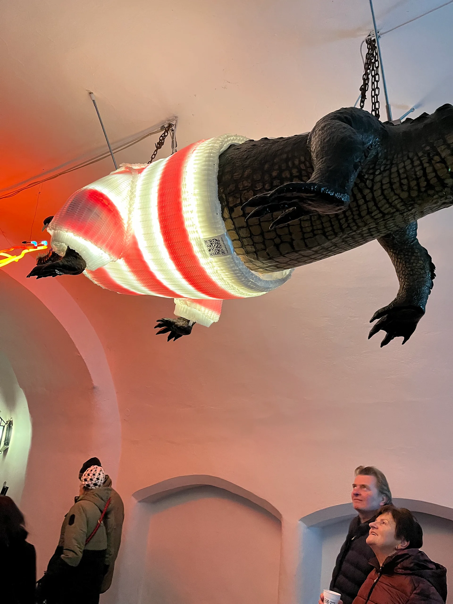
The Old Town Hall (**Stará radnice**) is the oldest secular building in **Brno**. The twisted pinnacle on its Gothic portal is rumored to be a satirical retaliation by the architect, who never received his rightful payment. Walking into the archway entrance, you will find the famous "Brno Dragon" (**Brněnský drak**—which is actually a stuffed crocodile) suspended from the ceiling, along with a wooden wheel mounted high on the wall. Each carrying its own ancient urban legend, they have long since become the spiritual totems of this city.
### **[The Cabbage Market (Zelný trh)](https://maps.app.goo.gl/7eFNmzceMhDa6SFj8)**
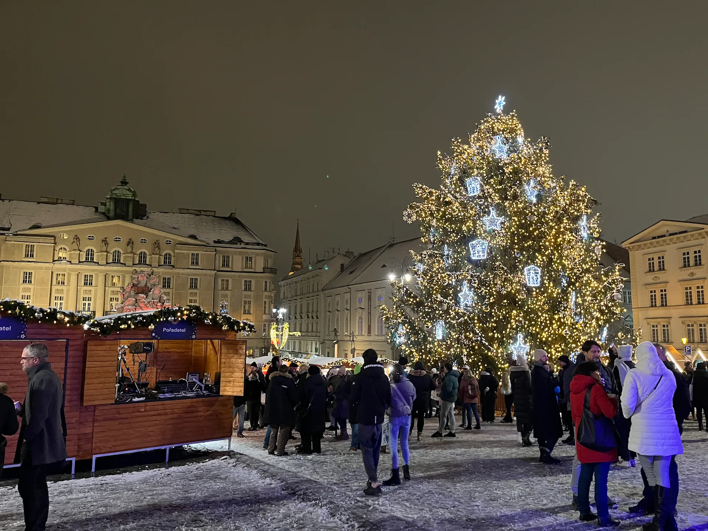
Since the 13th century, the Cabbage Market (**Zelný trh**) has been the pulse of local life in **Brno**. In the center of this gently sloping square stands the magnificent Baroque Parnassus Fountain (**Kašna Parnas**), surrounded by historic buildings and theaters filled with artistic flair. During the day, the square comes alive with colorful stalls selling local fruits, vegetables, fresh flowers, and handicrafts, exuding a rustic and warm atmosphere of daily life.

Hidden beneath the shadowy ground of the square lies a medieval labyrinth of tunnels (**Labyrint pod Zelným trhem**), which once served as cellars for food storage and wine brewing—explaining why many nearby restaurants feature underground seating designs. There is also an ossuary (**Kostnice u svatého Jakuba**) nearby, though personally, I found it a bit underwhelming and wouldn't highly recommend it. While the square serves as a social and market hub for locals on regular days, it transforms into a magical Christmas market during the festive season and occasionally hosts events like live music performances or big-screen sports viewings.
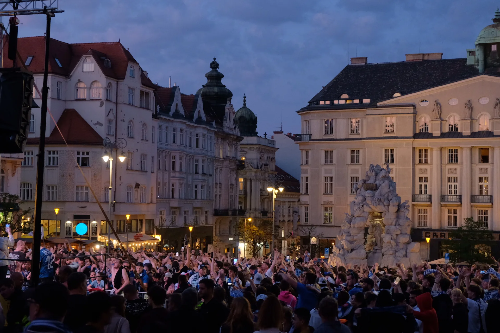
his photo captures the crowd watching the **Brno** ice hockey championship—Game 7, where Brno's own **HC Kometa Brno** faced off against **HC Dynamo Pardubice**. In the end, **HC Kometa** triumphed with a 3-0 victory, sending the entire city of Brno into a massive celebration. The Cabbage Market (**Zelný trh**) truly embodies the soul of Brno, and the presence of the Parnassus Fountain (**Kašna Parnas**) adds the perfect finishing touch to the square.
### [**The Cathedral of St. Peter and Paul (Katedrála svatých Petra a Pavla)**](https://maps.app.goo.gl/xzbaUykxq1DVtBAn9)
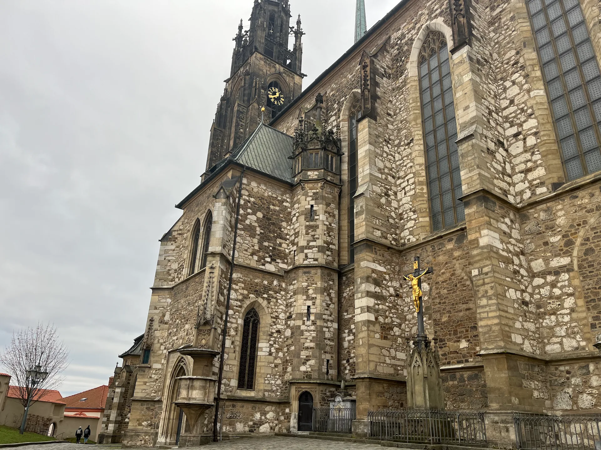Perched high on **Petrov** hill, the Cathedral of St. Peter and Paul (**Katedrála svatého Petra a Pavla**) is the most majestic icon of the **Brno** skyline. Its unique exterior and the interior's tile mosaic—which rivals the beauty of the Sagrada Família—look exceptionally romantic when the sunlight streams through. This grand Gothic structure has witnessed the rise and fall of the city, and the exquisite altar decorations inside showcase the intricate aesthetics of religious art.

The most famous historical anecdote here is the noon bell that rings early at 11:00 AM every day. This tradition commemorates a legend from the Thirty Years' War in 1645, when locals used a clever trick to make the Swedish army believe it was already noon, successfully forcing them to retreat. The cathedral is not only a beacon of faith, but the gardens on the hill where it stands also offer the most romantic corner to gaze out over the city lights at dusk. The student ticket for the tower climb is **40 CZK**, and as you make your way up the spiral staircase, you can get an up-close look at the well-preserved historic structures inside the tower.

Admission to the cathedral interior is free. Climbing up to the top offers a panoramic view of the **Brno** old town (**Historické centrum**), and the fortress standing on the distant hill is the Špilberk Castle (**Hrad Špilberk**).
### [**Free Square (nám. Svobody)**](https://maps.app.goo.gl/tnJPfLNDZjoMmmrd7)
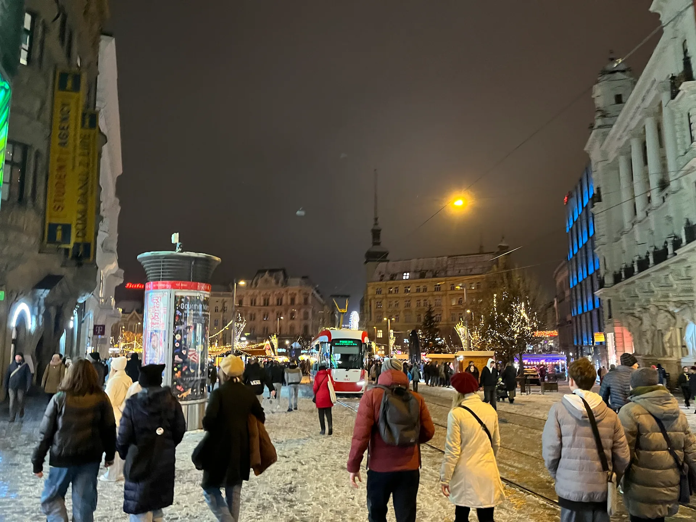**Náměstí Svobody** (Freedom Square) is the "heart" of **Brno**. This uniquely triangular plaza has been the crossroads of local life since the Middle Ages, surrounded by a mix of historic Renaissance buildings and modern geometric architecture. The most eye-catching focal point in the square is undoubtedly the avant-garde black marble astronomical clock (**Brněnský orloj**), often playfully nicknamed "the bullet." To commemorate the Thirty Years' War, a special glass marble drops from inside the clock every day at 11:00 AM, always attracting countless travelers and children who wait around to catch it and see who today's lucky winner will be. This square is also the city's most dynamic stage; whether it is the summer beer festival or the winter Christmas market filled with the aroma of mulled wine (**Svařák**), you will always witness an incredibly vibrant scene. As a side note, Brno was proudly named the **European Christmas Capital of 2024**!
### [**The Špilberk Castle(Hrad Špilberk)**](https://maps.app.goo.gl/9AFDGZvdSH2LXBEv7)
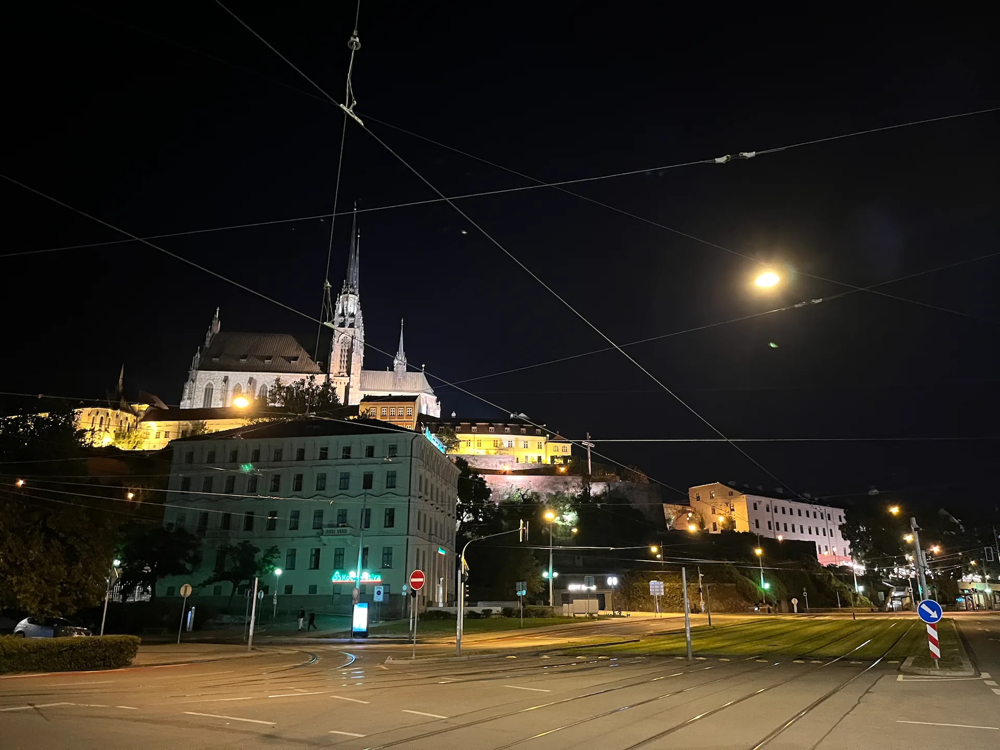Perched atop the hill, the Špilberk Castle (**Hrad Špilberk**) is another iconic landmark on the **Brno** skyline, matching the majesty of the cathedral. Built in the 13th century, this ancient fortress originally served as the royal residence for Moravian rulers. As history evolved, it was transformed into an exceptionally fortified Baroque military stronghold.
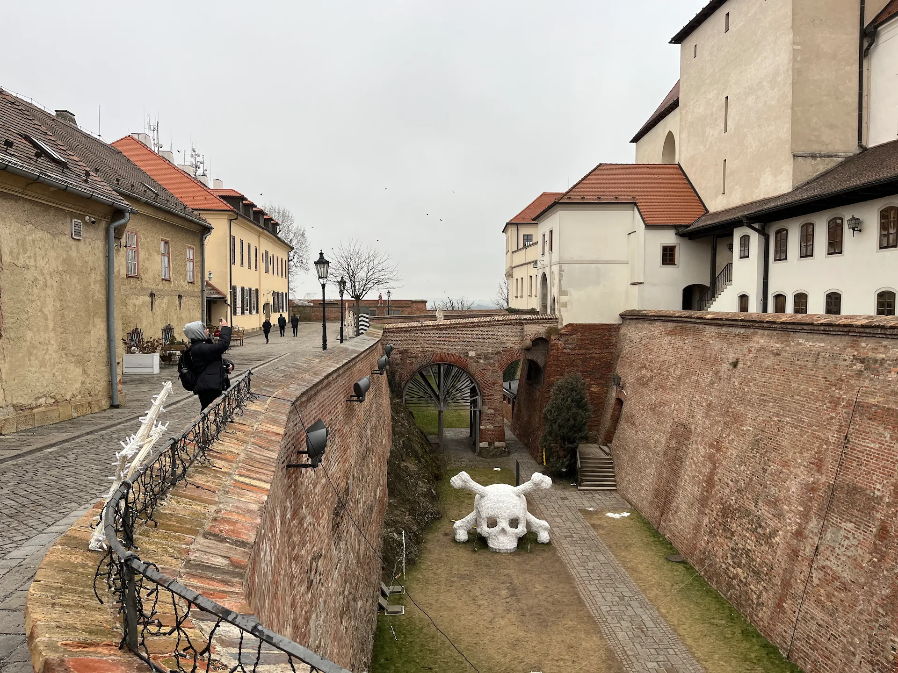
The most famous historical chapter of this site is its time spent as the "Prison of Nations," the most brutal and fearsome prison of the Austro-Hungarian Empire. The shadowy underground casemates (**Kasematy**) still preserve the iron torture instruments and wooden cells from that era, silently echoing the tragic stories of political prisoners and revolutionaries whose wandering souls were trapped here—adding a chilling, heavy, yet beautifully poignant aura to the fortress.

Today, the castle has long since shed its heavy historical burden, transforming into the Brno City Museum (**Muzeum města Brna**) and a vibrant exhibition space filled with artistic energy. Strolling up the winding park pathways to the summit, you can stand upon the weathered, ancient fortress walls and take in a 360-degree panoramic view of the entire **Brno** old town (**Historické centrum**) and the distant horizon. Especially at dusk, when the setting sun paints the entire sea of red roofs in a golden hue, it becomes the ultimate corner to escape the hustle and bustle, quietly enjoying the serenity and simplicity of the city.

If your time is limited, visiting **Hrad Špilberk** at evening is highly recommended! Admission to the grounds is free before 5:00 PM. After 5:00 PM, a light show begins, so an entrance fee is charged. However, simply walking around the outside of the castle walls to admire the city nightscape is an incredible experience in itself.
### [**St. Thomas's Church (Kostel svatého Tomáše)**](https://maps.app.goo.gl/LpzmgUMtDuypugYq5)
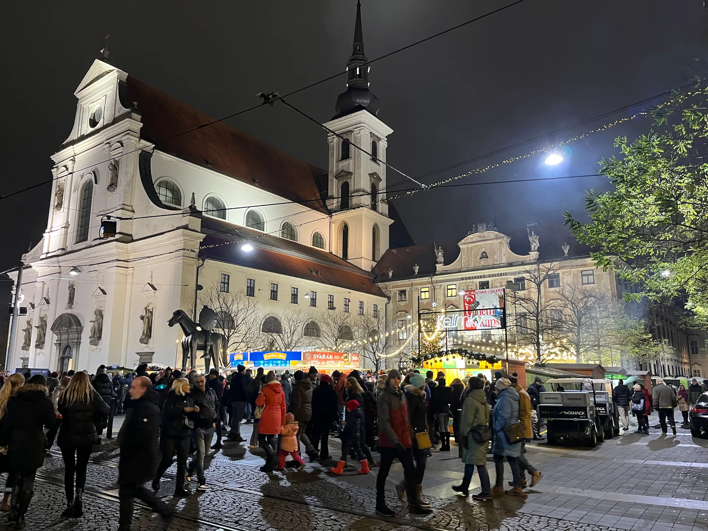The church underwent a massive Baroque renovation, shaping the grand and magnificent appearance it features today, complete with a resplendent interior and meticulously detailed carvings. The church's most famous historical chapter took place during the Thirty Years' War in 1645. When the Swedish army launched a fierce siege on **Brno**, the St. Thomas Monastery (**Augustiniánský klášter**) became a brutal battlefront, successfully repelling the enemy's assault and witnessing the ironclad resilience of the city.

Today, a colossal bronze statue of **Jošt Moravský** (Jobst of Moravia, often referred to as the statue of Courage) stands in the square outside the church, creating a powerful visual contrast between the avant-garde modern sculpture and the ancient Baroque architecture. The surrounding square frequently hosts cultural and artistic performances, and there is even a small Ferris wheel to enjoy. Nearly all churches in Brno are free to enter, though using cameras to take photos inside is generally not permitted. Many more churches remain unmentioned, waiting for wanderers to discover them on foot!

## Suburbs

### [**Brno Dam (Brněnská přehrada)**](https://maps.app.goo.gl/ecDm2doh4YHH4Sjq9)
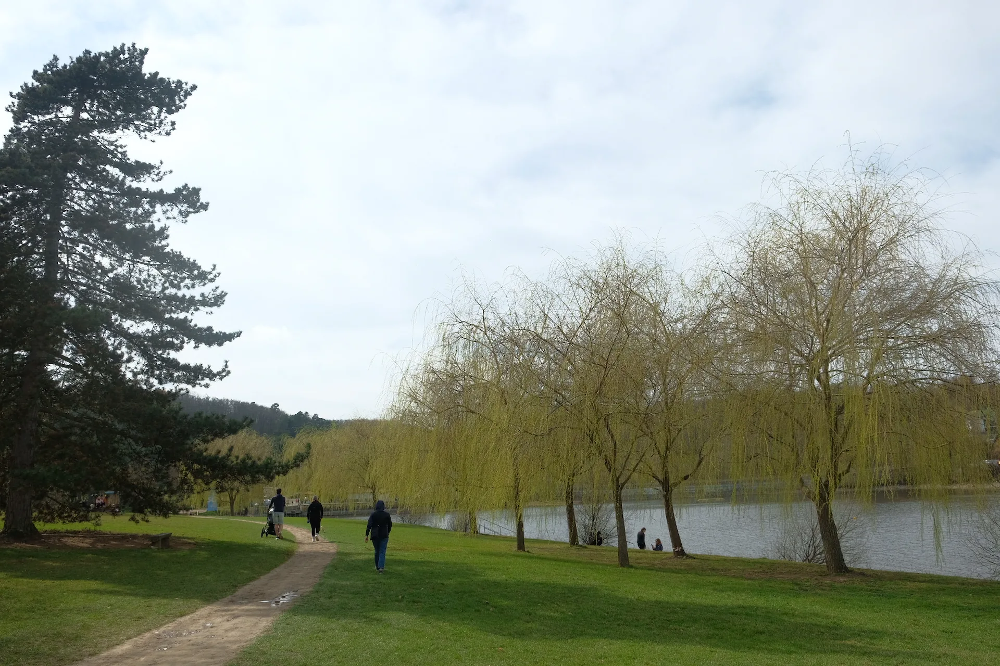
The dam is surrounded by lush, dense forests, with vast green lawns and sandy beaches stretching across both shores. Locals flock here to swim, paddle canoes, or sit at lakeside bars enjoying a fresh glass of Czech draught beer (**Čepované pivo**). It is highly recommended to come here for a picnic, have a few drinks, play cards, or throw a ball around, fully immersing yourself in the relaxed and slow-paced rhythm of Czech life.
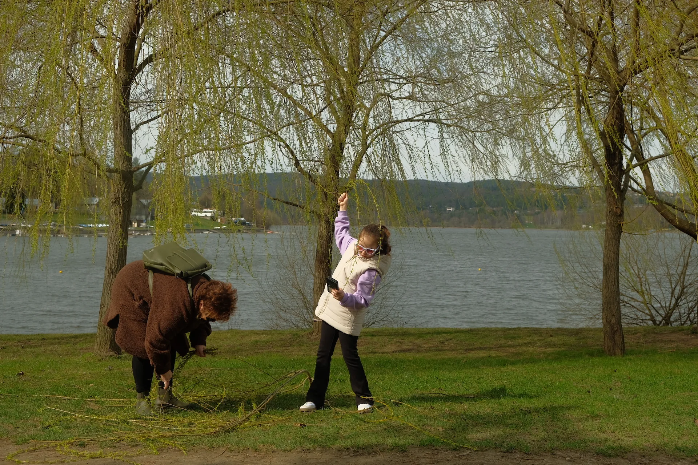

 Locals flock here to picnic, stroll, and walk their dogs. I even saw them weaving wreaths out of willow branches—it’s the absolute definition of life.
 
- Transportation

  Starting from the Brno Main Train Station (**Brno hl.n.**) is the most convenient option.
	- Take **Tram 1 (Šalina 1)** toward _Ečerova_ and get off at the **[Přístaviště](https://maps.app.goo.gl/K76gUvWqX7aeZVHe8)** stop (approx. a 25-minute ride).
	- After getting off, follow the signs and walk for about 5 minutes to reach the ferry pier and the lakeside lawns.

### [**Jeskyně Jáchymka**](https://maps.app.goo.gl/N3gjB83Vm2avqxDF7)
 
 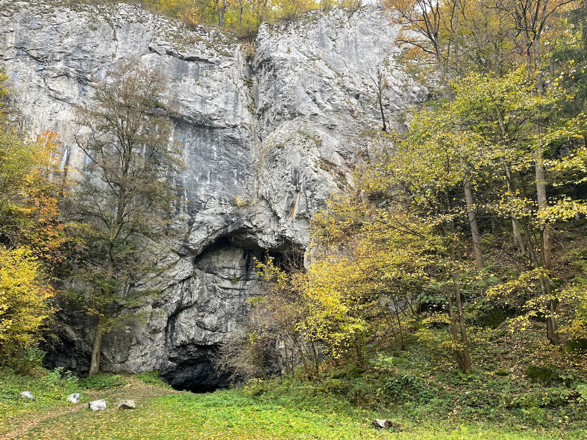
Located within the famous Moravian Karst (**Moravský kras**) nature reserve north of **Brno**, this is a natural limestone cave filled with a sense of mystery and adventure. **Jáchymka** is a completely open, non-commercialized karst cave where you can freely walk inside its massive rock arches to explore. Historically, this site served as a sanctuary for wild animals during the Ice Age (where a large number of prehistoric animal bones were once excavated) and was even converted into a saltpeter processing plant during the Middle Ages. As you pass through the shadowy caverns, sunlight streams down from the natural rock openings above, creating a mottled play of light and shadow that truly makes you feel like an explorer.
    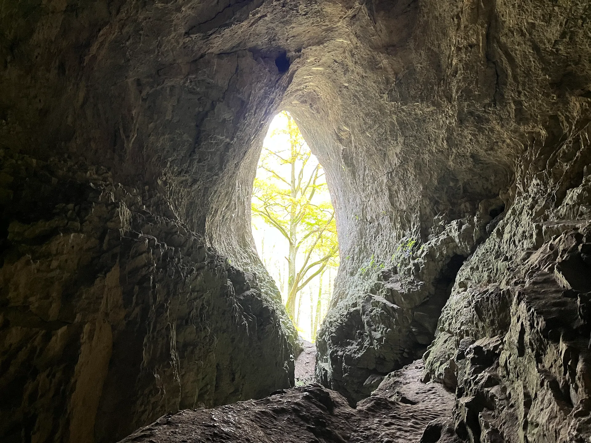
- Transportation
  
  This attraction is located in a deep valley near Blansko and requires transferring from a train to a bus. Overall, it is quite difficult to reach, and driving would be the fastest option. It is not highly recommended unless you have a specific interest, though the limestone karst topography is definitely one of Brno's major highlights.
	- **Train**: Take the **S2 commuter train** from the Brno Main Train Station (**Brno hl.n.**) to the **[Blansko](https://maps.app.goo.gl/T6743nmiyqfm7Q3ZA)** station (approx. 20–30 minutes).
	- **Bus**: Transfer to **Bus 226** right next to the Blansko train station, and get off at a stop near **Skalní mlýn** or **Vilémovice, Macocha** (depending on the schedule and route). Please note that Bus 226 operates outside zones 100+101, so you will need to pay separately in cash.
	- **Hiking**: After getting off the bus, follow the green or blue hiking trails for about 15–20 minutes to reach the karst cave (**Jáchymka**).
### [Hády Quarry (Lom Hády)](https://maps.app.goo.gl/RoFqFbRJMgmBMxKS6)
    
**Highly Recommended!!!** This is a nature escape I’ve personally visited multiple times, and it’s my absolute go-to spot whenever friends come to visit. Located on the eastern outskirts of **Brno**, this hidden gem is a stunning spectacle where "industry meets nature." **Hády** was originally a massive limestone quarry. After mining operations ceased, nature reclaimed the land, creating several hidden, crystal-clear, emerald-green ponds. The surrounding area is also dotted with charming local farms, where you can spot alpacas and other animals.

Thanks to its unique microclimate, Hády has become a sanctuary for many rare plant species. More impressively, its towering cliffside terrain makes it a top-tier, insider secret spot for catching the sunset or enjoying the city nightscape. At dusk, sitting on the edge of the cliff with a beer in hand, watching the setting sun paint the distant cathedral and the entire old town in a golden hue—the visual contrast between the rugged wilderness and the vast cityscape is utterly mesmerizing, making you feel beautifully small.

Locals often come here for a jog, or oddly enough, to practice parkour and ride dirt bikes. My Spanish friend even mentioned that the landscape here strongly resembles the Mediterranean terrain! All in all, this is an incredibly recommended spot—and compared to other nature getaways, it’s remarkably easy to reach!
    
- Transportation：
    
    Located on the edge of the city, taking the bus is the most direct option.
    - Take **Bus 8** from near the main train station and get off at the [**Kotlanova**](https://maps.app.goo.gl/YgTETCk1p8grpPeSA).
        
    - it is about a 30-minute walk to the cliffside viewpoint of the quarry, with the entrance located right by [Hotel VELKÁ KLAJDOVKA](https://maps.app.goo.gl/e8qZi6sZGKTShTB87). There are also other bus routes available that stop even closer to the entrance.
    
    - You can either return the way you came or head out through another exit at [Červený písek](https://maps.app.goo.gl/SuJDtSYo91uz1Zzi6)to take **Bus 64**. This route requires transferring to a tram along the way. There are many ways to navigate the transit here—just follow your map and you will be completely fine!

## Transportation

### City：Tram、Bus
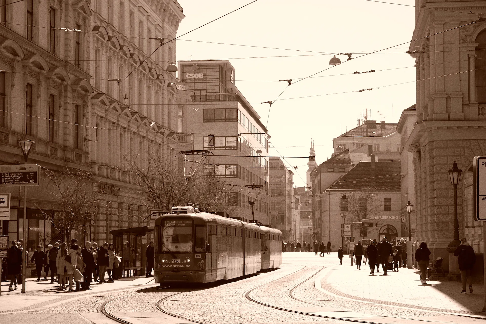
The city center is compact, and the old town (**Historické centrum**) is highly accessible simply on foot or by tram. For the tram, you can purchase a 1-day, or just pay per ride. The pricing is very reasonable. Credit cards (Visa/Mastercard or Apple Pay) are widely accepted. You won't be charged instantly; the system usually aggregates and settles the total balance at the end of the day. Just make sure the machine successfully beeps when you tap! Based on my experience living there for a year, I was only ticket-checked 3 to 4 times, so the chances of being checked might not seem high, but it's always best to stay validated.

#### 💳 Tapping Your Credit Card (Beep & Go)

- **Short-distance (Within 15 mins)**: Tap your card **when boarding**, and you have to **tap again when hopping off**. The system will automatically calculate the fare as **20 CZK**.
    
- **Long-distance (Within 60 mins)**: Tap your card **when boarding**, and there is **no need to tap when hopping off**(the system automatically counts it as a 1-hour ride for **25 CZK**; tapping again won't harm anything).
    
- **Daily Cap (24-Hour Pass)**: If you ride extensively throughout the day, the system is incredibly smart—once your cumulative taps reach **90 CZK**, it will stop charging you and automatically convert your fare into a 1-day pass.
    

#### 🎫 Paper Tickets (Single-ride)

If you prefer the reassuring feeling of holding a physical ticket, you can purchase them from the yellow ticket vending machines on the streets or at major tram stops. **Remember to validate your ticket upon boarding** by inserting it into the stamping machine (the slot is usually located right below the card sensor).

- **15-minute ticket**: 20 CZK
    
- **60-minute ticket**: 25 CZK
    
- **90-minute ticket**: 35 CZK
    
- **24-hour ticket**: 90 CZK

### Brno Overland Cross-Border Transportation Guide

#### 🇨🇿 Prague, Czech Republic — A Must-Visit Hub in Central Europe

_FlixBus student tickets are dirt cheap! A one-way ticket costs only around 49–120 CZK (which can be as low as 2 USD!!). [Click here for FlixBus discounts & deals]_

- **Transport Options**: RegioJet Bus, FlixBus, Czech Railways (ČD) Train
    
- **Travel Time**: Approx. 2.5 hours
    

#### 🇦🇹 Vienna, Austria — The Closest International Transit Hub

_ÖBB trains are highly recommended—the cheapest tickets can go down to around €7, whereas buses usually cost upwards of €10._

- **Transport Options**: RegioJet Bus, FlixBus, ÖBB (Austrian Federal Railways) Train
    
- **Travel Time**: Approx. 1.5 to 2 hours
    

#### 🇸🇰 Bratislava, Slovakia — A Perfect Day-Trip Neighbor

_Great for a quick day trip! Due to Brno's close proximity to Slovakia, many Slovak students choose to study in Brno, and the languages of the two countries are almost entirely mutually intelligible._

- **Transport Options**: RegioJet Bus, FlixBus, Train
    
- **Travel Time**: Approx. 1.5 hours
    

#### 🇭🇺 Budapest, Hungary — Top Recommendation in Central Europe

_Highly, highly recommend Budapest! Buying tickets last-minute can be pricey, but if you plan ahead, buses and trains cost and take about the same._

- **Transport Options**: Train, RegioJet Bus, FlixBus
    
- **Travel Time**: Approx. 4 hours
    

#### 🇵🇱 Kraków, Poland — A City of Rich History and Culture

- **Transport Options**: RegioJet Bus, FlixBus, Train
    
- **Travel Time**: Approx. 4.5 to 5.5 hours
    

#### 💡 Dynamic Pricing Travel Tips

Train and bus fares in Europe operate mostly on dynamic pricing. For buses, it is highly recommended to book **2–3 days in advance** to secure cheaper fares. However, during peak holiday seasons, tickets can sell out completely, so you'll want to reserve your seats even earlier!

### ✈️ Brno Airport (BRQ) Routes

Brno has its own small regional airport. If you are looking to fly to Western or Southern Europe on a budget, you can directly consider the following direct low-cost carrier (LCC) options:

- **Milan, Italy**: Fly with **Ryanair**; flight time is approx. 1.5 hours.
    
- **London, UK**: Fly with **Ryanair**; flight time is approx. 2 hours and 15 minutes.
    

Generally, ticket prices range around **1,000–1,500 NTD**, and the absolute cheapest deals can even drop to **600 NTD**. It is highly recommended to book your flights well in advance!
## 🏨 Accommodation

Anywhere near the Brno Main Train Station (**Brno hl.n.**) is a great place to stay! The most prominent option is the  **Grandhotel Brno**, located right across from the station. The price is approximately **1,500–2,000 NTD** per person per night, while local hostels cost around **600 NTD** per night.
## 🍽️ Food & Drink Recommendations

#### 🇨🇿 Local Cuisine & Steaks: U Dřevěného vlka ⭐️⭐️⭐️⭐️⭐️

- **Review**: This place offers a different daily lunch menu from Monday to Friday. The food is absolutely delicious and very reasonably priced, ranging around **200–400 NTD**. The interior murals are stunning, but keep in mind that tap water isn’t free here!
    

#### ☕ Brunch & Café: Kafec ⭐️⭐️⭐️⭐️⭐️

- **Review**: Highly, highly recommend this brunch spot! Their signature waffles/toasts are incredible, and the price is also around **200–400 NTD**. Many of my friends have even crowned it the best toast they’ve ever had in their lives.
    

#### 🇻🇳 Vietnamese: Gỗ Brno - Vietnamese Street Food ⭐️⭐️⭐️⭐️

- **Review**: A great go-to if you’re craving Vietnamese. You’ll actually find an abundance of Vietnamese cuisine all across the Czech Republic. **Gỗ Brno** offers a lovely atmosphere and is quite affordable.
    

#### 🍸 Bar & Pub: Utopia ⭐️⭐️⭐️⭐️

- **Review**: The ultimate social hangout that everyone loves. It has a great vibe, plenty of space, and you can even play pool here. Best of all, the drinks are super cheap.
    

#### 🇮🇳 Indian: Annapurna

- **Review**: Recommended by friends, though I haven't personally tried it yet. It’s located near the main train station (**Brno hl.n.**) and is very budget-friendly.
    

#### 🍜 Ramen: TOPPU RAMEN ⭐️⭐️⭐️

- **Review**: A ramen spot recommended by a Georgian friend. Honestly, if you're comparing it to the authentic ramen back home, it’s just average, haha.
    

#### 🇳🇵 Nepalese: Pokhara

- **Review**: A local Nepalese restaurant recommended by residents, though I haven't had a chance to try it myself.

## Other recommandations
### Music Instrument Store：[Kytary - Brno store](https://maps.app.goo.gl/BiQ2RyaEpxP6ZzoT7)
The biggest music instrument store in Brno, PRS is much cheaper than in Taiwan! You can also see Furch, the brand famous for its hand-made guitar, the sound is amazing!

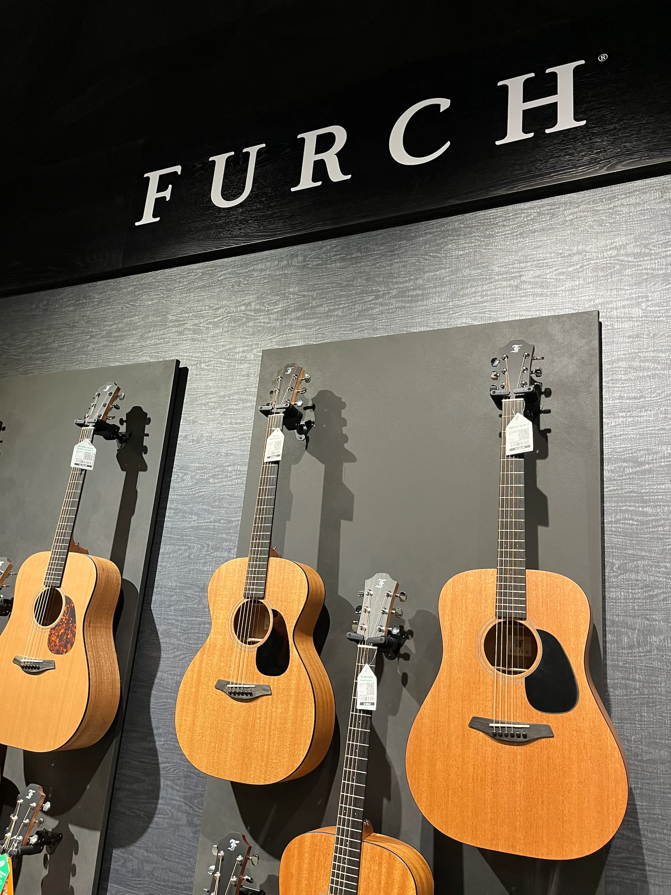
### Second-hand Camera Store：[Fotobazar Kounicova](https://maps.app.goo.gl/yXmCuuhuvaev6Fuh8

Most of them are older models; the most recent one I saw last time was a 2019 Fujifilm X-T20. Paired with the 18-55mm lens, it was priced at around 20,000 NTD, which is overall quite reasonable.
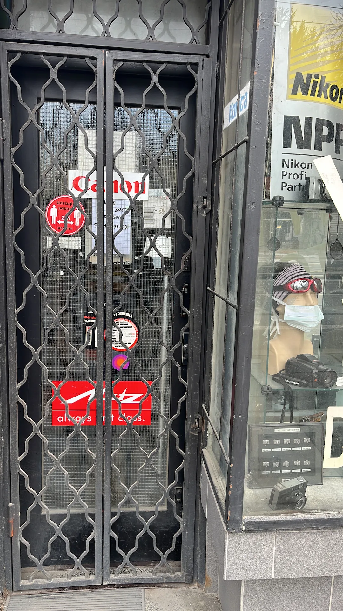

### Camera Store：[ANTIKFOTO Ltd.](https://maps.app.goo.gl/i4nrXoDNeB8r8jYe9)
I have been there once, worth a visit.
