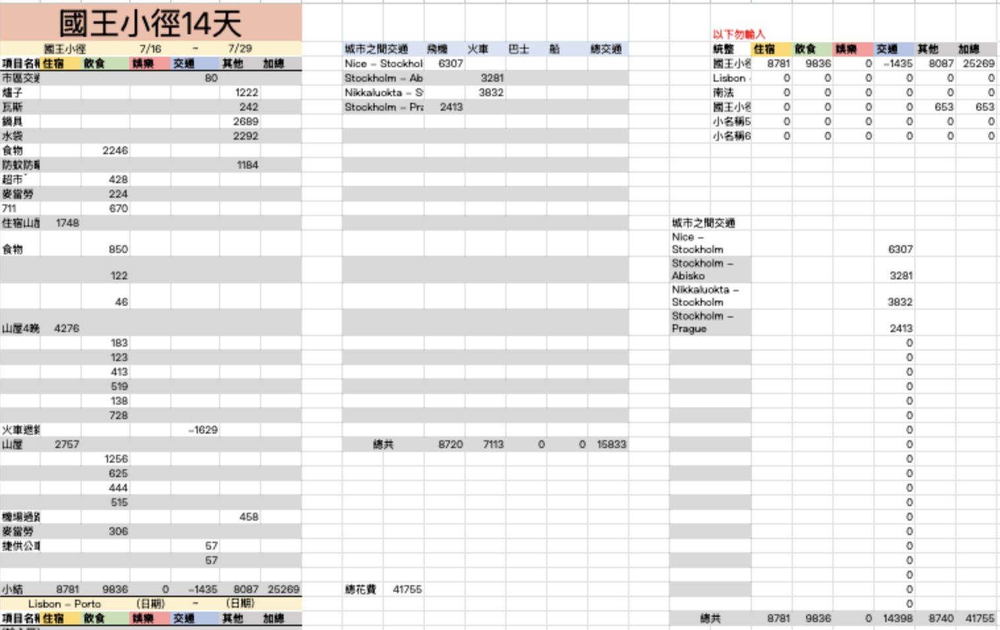
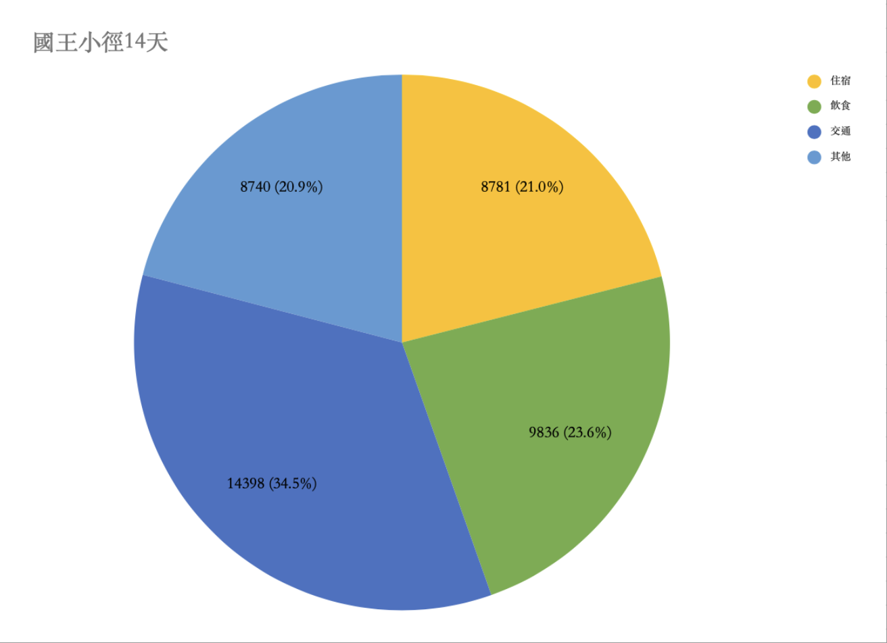

### **Solo Travel Index: ⭐⭐⭐**

- If you plan to camp and cook your own meals, it’s highly recommended to go with a group to share the weight of the gear.
    
- For those with a sufficient budget, staying in mountain cabins is the top choice for solo travelers.
    
- These cabins come equipped with kitchens, sparing you the physical burden of carrying heavy cooking equipment.
    
- Small supply shops are scattered along the trail, so there’s no need to worry about running out of essentials.
    
- If you plan to rely on cabins, I strongly suggest becoming an **STF Member** to save significantly on accommodation costs.
    
- While traveling with others is easier and safer, the solitude and the profound sense of accomplishment found in solo travel are irreplaceable experiences.

### **Budget Travel Index: ⭐⭐**

- The cost of the trip largely depends on your accommodation choices: cabins along the trail cost about 
    
- Combined with the transportation to Abisko in the Arctic Circle and the high cost of living in remote areas, the total expenses are not to be underestimated.
    
- For budget-conscious travelers, this is not exactly a cheap, "spur-of-the-moment" trip.

### **Essential Information**

- **Total Length:** Approximately 440 km.
    
- **Endpoints:** Starts at **Abisko** in the north and ends at **Hemavan** in the south.
    
- **Location:** The entire route lies within the **Arctic Circle**, passing through Europe’s largest wilderness reserve.
    
- **Geography:** Features a mix of high mountains, tundra, deep valleys, shimmering lakes, and lush birch forests.

### **Core Highlights**

- **Sweden’s Highest Peak:** The route passes by **Kebnekaise**; many hikers take the opportunity to challenge the summit.
    
- **Sami Culture:** This is the traditional home of the **Sami** people. You can see Sami villages and may even encounter reindeer herds slightly off the main path.
    
- **Well-Established Cabin System:** The **Swedish Tourist Association (STF)** provides cabins every 10–20 km. These offer beds, kitchens, and shops, allowing hikers to complete the trail without heavy camping gear. There is no electricity or signal, offering a chance for true isolation.
    
- **Sauna Experience:** Almost every cabin has a sauna. It’s included for overnight guests but requires a fee for others. Hikers usually need to carry and chop the wood themselves (if they know how).

### **The Most Popular Section: The North (Abisko to Nikkaluokta)**

If time is limited, most hikers choose the classic northern section (approx. 105 km), which usually takes 5 to 7 days:

- **Convenience:** Abisko is directly accessible by train.
    
- **Spectacular Scenery:** Includes the famous **Tjäktja Pass** (the highest point) and breathtaking views near Kebnekaise.
    
- **Fjällräven Classic:** The world-famous hiking event hosted by the brand Fjällräven takes place on this exact route every year.

### **Practical Information**

- **Best Seasons:**
    
    - **Summer Trekking:** Late June to mid-September. (July has more mosquitoes; late August offers the most stable weather and beautiful autumn colors).
        
    - **Winter Skiing:** March to May, suitable for **Ski Touring**.
        
- **Difficulty:** Moderate. Trails are well-marked with red markers. While there is some elevation change, most sections are gentle and suitable for those with basic fitness.
    
- **Gear Advice:** Even in summer, Arctic weather is unpredictable. Windproof and waterproof shells, thermal base layers, and comfortable hiking boots are essential. If staying in cabins, you can skip the stove.
- **Youth Accommodation Discount:** It’s cheaper to pre-book if you're over 25, while those aged 16–25 get a better rate for walk-ins.

### **Getting to Abisko**

- **By Air (Norwegian or SAS):** Approx. 1h 35m. Price: NT$2,500 – $6,000.
    
- **By Train (SJ National Rail):** Approx. 24h. Price: NT$1,500 – $5,000 (usually much cheaper if booked early).

### My Itinerary

| Day  | Route                                                                                                         | Distance | Accommodation                                                                            | Sauna | Shop | Notes                                                                                           |     |
| ---- | ------------------------------------------------------------------------------------------------------------- | -------- | ---------------------------------------------------------------------------------------- | ----- | ---- | ----------------------------------------------------------------------------------------------- | --- |
| Day0 | Arriving at Abisko Turiststation                                                                              | -        | [STF Abisko Turiststation](https://maps.me/link/ge0/06FMb0SQas/Abisko_turiststation)  | ✅     | ✅    | There are some one-day-trip spots around Abisko                                                 |     |
| Day1 | Abisko → Abiskojaure                                                                                          | 15km     | [STF Abiskojaure](https://maps.me/link/ge0/Q6FMH6B2iK/Abiskojaure_Fjällstuga)            | ✅     | ✅    | Shower in river with beautiful mountain views                                                   |     |
| Day2 | Abiskojaure → Alesjauree                                                                                      | 20km     | [STF Alesjaure](https://maps.me/link/ge0/Y6FGpap71j/Alesjaure_Fjällstuga)             | ✅     | ✅    | The longest distance in the trip, passing by beautiful lake                                     |     |
| Day3 | Alesjaure → Tjäktja                                                                                           | 13km     | [STF Tjäktja](https://maps.me/link/ge0/Q6FD1wPJAT/Tjäktja_Fjällstuga)                    | ❌     | ❌    | - Small, rustic mountain cabin in a magnificent location.  - Snow and waterfall on the route |     |
| Day4 | Tjäktja → Sälka                                                                                               | 12km     | [STF Sälka](https://maps.me/link/ge0/U6FGICC4TL/Sälka_Fjällstuga)                        | ✅     | ✅    | - Go through the highest point Tjäktja Pass - situated in the vast plain                     |     |
| Day5 | Sälka → Singi                                                                                                 | 12km     | [STF Singi](https://maps.me/link/ge0/U6FEqvrZzY/Singi_Fjällstuga)                        | ❌     | ❌    | Sami village on the right side                                                                  |     |
| Day6 | Singi → Kebnekaise Fjällstation                                                                               | 14km     | [STF Kebnekaise](https://maps.me/link/ge0/U6FGFc-uuM/Kebnekaise_fjällstation)            | ✅     | ✅    | Prepare for trekking to the summit                                                              |     |
| Day7 | Kebnekaise Fjällstation -[Kebnekaise sydtoppen](https://maps.me/link/ge0/g6FGGRvyeh/Kebnekaise_sydtoppen)  | 16km     | [STF Kebnekaise](https://maps.me/link/ge0/U6FGFc-uuM/Kebnekaise_fjällstation)            | ✅     | ✅    | - Round trip takes roughly 10 hours                                                             |     |
| Day8 | Kebnekaise → Nikkaluokta                                                                                      | 19km     | Back to Kiruna or stay one night at Nikkaluokta                                          | ❌     | ✅    | Some super expensive accommodation, which is recommended to skip it.                            |     |
| Day9 | Nikkaluokta → Kiruna / Back home                                                                              | -        | -                                                                                        | -     | -    | -                                                                                               |     |

### Tips:
- Consider pre-booking flexible train or flight tickets so you can adjust your plans if you finish earlier or later than expected.
- Kebnekaise's Southern Peak (Sydtoppen) used to be the highest point in Sweden, but its elevation fluctuates due to snow accumulation. Currently, the Northern Peak (Nordtoppen) is about one meter higher than the Southern Peak. However, since the Northern Peak is much less accessible, most people still regard the Southern Peak as the summit of Sweden.

### **What does the shop sell?**

#### **1. Core Provisions**

This is the main section of the shop, focusing on shelf-stable and easy-to-cook items:

- **Staple Dried Goods:** Pasta, macaroni, rice, oatmeal, and instant mashed potatoes.
    
- **Canned & Pouch Foods:** Canned meatballs (Köttbullar), SPAM, canned tuna, mackerel in tomato sauce, and various concentrated soup bases.
    
- **Freeze-Dried Meals:** Various flavors of hiking meals (more expensive, but the most time and energy-efficient option).
    
- **Condiments:** Salt, pepper, spreads (like the famous Swedish tube caviar, **Kalles Kaviar**), and cheese spreads.
    

#### **2. Energy & Leisure**

- **Snacks:** Energy bars, chocolate bars, trail mix, and biscuits.
    
- **Drinks:** Instant coffee, tea bags, hot cocoa powder, powdered juice, beer, and soda.
    
- **Swedish Specialties:** Crispbread (**Knäckebröd**) and various Nordic sweet biscuits.
    

#### **3. Gear & Essentials**

A lifesaver if you lose or break small items:

- **Fuel:** Gas canisters (Primus) and methylated spirits (alcohol fuel).
    
- **Medicine & Hygiene:** Tiger Balm (surprisingly common!), band-aids, blister pads, toilet paper, mosquito repellent, and sunscreen.
    
- **Spares:** Shoelaces, basic cutlery, water bottles, and matches or lighters.
    

> **My Personal Go-To:** I mostly bought beef jerky, protein bars (ate about 2–3 a day), and chocolate. I bought my freeze-dried meal packs in the city beforehand to save money.

---

### **Kungsleden (The King’s Trail) Summer Trekking Gear List**

#### **Clothing**

- **Waterproof/Windproof Shell:** Gore-Tex grade jacket and trousers (Arctic winds and rain are no joke).
    
- **Insulation Layer:** A lightweight down or synthetic jacket.
    
- **Base Layer:** Moisture-wicking short sleeves (bring 2 sets for changing).
    
- **Hiking Socks:** Wool hiking socks; 2–3 pairs recommended.
    
- **Footwear:** Broken-in professional hiking boots, plus lightweight sandals or flip-flops for relaxing at camp. Mid-to-high cut boots are recommended as you’ll occasionally need to cross small streams.
    
- _Basically, the same layering system used for trekking high-altitude peaks (like Taiwan's Top 100 Peaks) works perfectly here!_
    

#### **Carry & Sleep System**

- **Hiking Backpack:** 50–70L (depending on whether you are camping), preferably with a rain cover.
    
- **Sleeping Bag:** Recommended comfort rating between **0°C to -5°C**. If you stay in huts, blankets are provided and are very comfortable.
    
- **Sleeping Pad:** Inflatable or foam pad (if camping, an R-value of 3+ is recommended).
    
- **Tent:** If you don't plan on staying in huts every night, you need a high-altitude tent with strong wind resistance.
    
- _The cabins provide pillows and duvets and are quite clean. If you have the budget, staying in the huts is very comfortable. If wild camping, be prepared for mosquitoes and the "Midnight Sun" affecting your sleep._
    

#### **Accessories & Cooking**

- **Trekking Poles:** One pair (depending on preference). Except for the Kebnekaise climb, most sections are relatively flat.
    
- **Headlamp:** Necessary if you are trekking closer to September.
    
- **Cooking Gear:** Lightweight stove burner, personal cutlery, and a water bladder or bottle (I brought a 1L bottle).
    
- **Water Filter:** Although the stream water is crystal clear and generally safe to drink, having a filter provides peace of mind.
    

#### **Electronics**

- **Power Banks:** Bring several high-capacity ones; there are no charging outlets in the trail cabins.
    
- **Chargers:** Outlets at the main mountain stations (start/end points) use the **Type C/E/F (European round-pin)**plug.
    
- **Offline Maps:** You **must** download offline maps on your phone. Physical maps and route info are also available at the start and end points.
    

#### **Personal Items & Others**

- **First Aid Kit:** Blister pads, painkillers, cold medicine, band-aids, and alcohol wipes.
    
- **Hygiene:** Toothbrush, small towel, sunscreen, mosquito repellent (Arctic mosquitoes are intense in summer), and eco-friendly soap (for river washing).
    
- **Money:** Basically **cashless**. I didn't use cash once the entire trip; a credit card is enough. However, you might want to bring a backup card or some emergency cash just in case of card issues.
    
- **Camera Gear:** Camera, spare batteries, and memory cards.

### **Recommended Apps for Your Trek**

#### **⛰️ STF: The Swedish Tourist Association App**

This app provides essential information for all kinds of Swedish outdoor activities. Its primary use is for searching and booking **Mountain Cabins** and **Mountain Stations** across Sweden.

- **Member Discounts:** I highly recommend joining as a member online beforehand. You get a significant discount on cabin stays; if you plan on staying in huts throughout the trip, the membership pays for itself.
    
- **Mountain Intel:** The app offers detailed info on cabin facilities (e.g., whether they have a sauna, a small shop, or electricity), which is crucial for planning your pack weight.
    

#### **🚊 SJ: Swedish Railways Official App**

The primary platform for booking transport to the Kungsleden trailheads (such as Abisko or Hemavan). Use this to check and buy long-distance train tickets, including the **Arctic Night Train** from Stockholm.

- **Student Discounts:** If you are a student, be sure to select the "Student" fare—it will save you a huge chunk of your budget.
    
- **Real-time Updates:** Weather in the Arctic Circle is unpredictable, and train delays are common. The app provides real-time notifications for platform changes and delays.
    
- **Digital Tickets:** Swedish trains are fully digitized. You just need to scan the QR code in the app. Note: Tickets are **always** checked on long-distance routes.
    
- **Refund Policy:** SJ has a great refund system: a 25% refund for delays over 30 minutes, 50% for 1 hour, and a full refund for 2 hours. You can request this directly in the app or via email; their customer service is very efficient. I took the train three times—twice I got 25% back and once 50%. Delays are the norm, so plan your connections accordingly!
    

#### **🚆 SL: Stockholm Public Transport App**

This is the app for Greater Stockholm, covering buses, the metro (T-Bana), and ferries. If you’re staying in the city before heading north, this is a must-have. Taking public transport via SL is also much cheaper than the "Arlanda Express" for airport transfers.

- **Contactless vs. App:** While you can tap-to-pay with a credit card at the gates, buying period passes (like 24-hour or 72-hour tickets) in the app is often much more cost-effective than single fares.
    
- **Route Planning:** It offers much more accurate route planning for Stockholm than Google Maps, showing connections that Google sometimes misses.
    

#### **🗺️ MAPS.ME: Essential Offline Maps**

- **Offline Navigation:** There is **zero signal** on the trail except at the very start and end, so offline maps are mandatory. MAPS.ME uses OpenStreetMap data, which marks wilderness trails, cabins, and lakes much more precisely than Google Maps.
    
- **Custom Pins:** You can pre-mark cabins, water sources, or potential campsites. This helps immensely with "uncertainty anxiety" during long trekking days.
    
- **Battery Efficient:** Compared to other map apps, it processes quickly offline and saves battery—critical since there are no charging opportunities on the trail.
    

#### **⛰️ AllTrails: The Global Hiker’s Database**

Great for researching elevation gain and trail conditions before you set off.

- **Trail Details:** Provides precise elevation profiles and estimated completion times to help you manage your daily physical output.
    
- **Community Reviews:** You can read comments from hikers who passed through just days ago to check for recent snow, deep puddles, or trail damage.
    
- **Pro Features:** If you upgrade to Pro, you can download GPX files and set "off-route" alerts—a great safety net for **solo hikers**.
    

#### **⛰️ Relive: Turn Your Trek into a Movie**

- **3D Route Recaps:** This app combines your GPS data with your photos to generate a 3D animated video of you "flying" over the mountains. It perfectly captures the scale of the Kungsleden.
    
- **Visual Storytelling:** It’s a great way to document your journey; an animation often captures the hardship and beauty of the trek better than a static photo.
    
- **Visual Memories:** The video highlights your highest point and total distance—the best souvenir after completing this "Arctic Marathon." _Note: This app consumes significant battery, so monitor your power supply.

### **Money-Saving Tips & Strategy**

When I first planned this trip, I was worried about bad weather or unexpected delays, so I built in plenty of buffer time. For the last few nights, I mostly wild camped. I traveled from Nice, France, to Stockholm for this trek; however, if you are coming from Taiwan, the total budget would likely range between **NT80,000andNT100,000**.

#### **Accommodation**

- **Wild Camping:** Pitching a tent is free, but you’ll need to be mindful of the swarms of mosquitoes and the constant daylight. If you are traveling in a group, sharing a tent is a great way to split the weight and cost.
    
- **Mountain Cabins:** If you are a solo hiker, I recommend staying in the STF cabins. It saves you from carrying the heavy weight of a tent, sleeping pad, and cooking gear.
    

#### **Food & Meals**

- **Cooking:** If you stay in the cabins, they provide matches, stoves, and cookware. You can rely on dry snacks/rations during the day.
    
- **Shopping:** The small grocery shops in the mountain cabins are relatively expensive, but buying food there saves a lot of space and weight in your pack, which can make your hike much more enjoyable.
    

#### **Transportation**

- **Book Early:** Train tickets from Stockholm to the Arctic Circle are significantly cheaper if booked well in advance. You can also consider entering **Abisko** via the Norwegian side (Narvik) as an alternative route.
    
- **Delays & Refunds:** Long-distance trains in Sweden are prone to delays—remember to claim your refund via the app if this happens! It’s a great way to recoup some of your travel costs.

