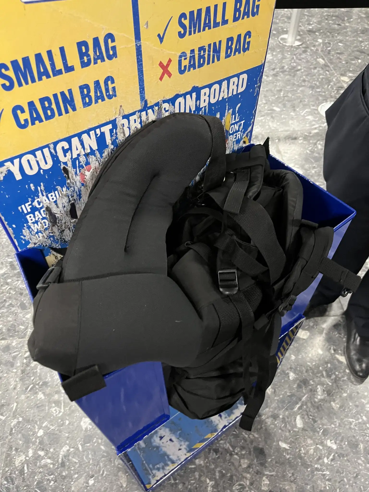

## 歐洲廉航生存攻略

分享個來歐洲必須知道的廉航攻略！歐洲機票常常便宜到不可思議，窮學生差不多就是哪裡便宜往那裡飛，所以整理了一些網路上可能查不到的小攻略。歐洲廉航最常見的就是 Ryanair、Easyjet、Wizz 等等，個人慣用購票程序：
> 
> 1. **Skyscanner**：出發地選定後，目的地搜「Everywhere」找靈感。
>     
> 2. **官方 App 管理**：獲取 6 碼 Confirmation Number 後直接匯入 App。
>     
> 3. **線上 Check-in**：**務必提前完成！** 尤其是 Ryanair，沒先線上報到現場會被重罰。
>

基本上提前個1~2小時抵達機場都還可以，主要看安檢人多不多。

## ✈️ 那些「內行人」才知道的小撇步

- **系統語言溢價**：切換語言和地區，有機會找到更便宜甚至原本找不到的機票。之前用德語找到瑞士航空比一般廉航便宜大概6000的布拉格-冰島來回機票。
    
- **多航點佈局**：在布爾諾時，我會同時監控周圍城市的機場（ **PRG / VIE / BTS / KRK** ）的票價。

- 提早訂票和避開熱門日期 (**聖誕節**、**復活節**、**暑假**)

## 廉航規範

會有很多種方案可以選，窮學生肯定都選最基本不含行李的方案，因為行李錢通常超出機票本身價格，所以建議準備約**30升以下**的包包。

- Ryanair：40* 20* 25cm

- Easyjet：56* 45* 25cm

- Wizz：40* 30* 20cm

各家都差不多，實際以官網為主。

不過後來觀察到很多人不會買登機行李但還是會帶行李箱或大包包，因為上飛機後**大家都可以用登機行李櫃**，之前搭了大概10次都沒被刁難行李，不過近期似乎查得比較嚴謹，大概有一半的機率如果包包太大會被叫去把包包塞到小盒子，塞進去就會給過，利用口袋、腰包腰帶等等把東西放或掛在身上就可以(不想這麼狼狽就不要超出規定哈哈)。

## ESN卡優惠：Ryanair 9折加免費托運行李4次

規範：提前28天訂票

可使用期間：9/1~6/15

使用方式：

>1. 將Ryanair連結到ESN卡
>
>2. 進去[官網](https://l.facebook.com/l.php?u=https%3A%2F%2Fwww.ryanair.com%2Fgb%2Fen%2Fplan-trip%2Fexplore%2Ferasmus%3Ffbclid%3DIwZXh0bgNhZW0CMTAAYnJpZBExbFlvWDl3UmxycFRmUGlJM3NydGMGYXBwX2lkEDIyMjAzOTE3ODgyMDA4OTIAAR7oZxnavHOeYfXOlvfjx8ddz8o1cAXynjkf9l9_F2q2lWjBJke9wqJdypy8ig_aem_FhBW9ZewzIvAq0DmIuF7qQ&h=AT6cb21hmYOzITHBmRCIFjJYoLZpxMRooQp7lPus5gctyxY50HLLUqbSYAlO5rTfQIBhqgOHWsrvWuA4KKA7V8dEN7zV2sVhhmAUiQpuTCfpsOmJNXmMYgT3QCYkp4EFKBYVxjRCXg&__tn__=-UK-R&c[0]=AT6h6SIR65cfMjWWRCpyD-6OGJPExwji9gOtdIHWz10huZxC0l27s6oTF9eSx8pIjxDJ_MEKS38Wn1TuC-c2AQM2PLU93igSiGKY6K2KXxb2WvGcp2V-EuzhOP1PHueNKvSQYEyQmF1wAqF7FIGTxeH-zlpZRg9e6VL6udF14xrWeSoeSJxQuBCWjD7xLIRPVQshYm1k_CBjLDsI4IA60Wx4LAPUYjQ)後按右上角「myRyanairPortal」
>
>3. 按「My account」
>
>4. Your personal information下面按「Erasmus」
>
>5. Member details 完整的話應該就可以訂票了 (訂優惠票的方式跟一般訂票地方不同)

以上是半年搭超過10家廉航公司的經驗分享，機票常常比火車巴士還要便宜，所以善加利用安排肯定可以讓歐洲交換生活更值回票價。最後提醒一個城市可能有很多個機場記得看清楚~~

圖為easyjet和ryanair箱子大小供參考，黑色包包為50升軟支架登山包，可以極限塞進去

